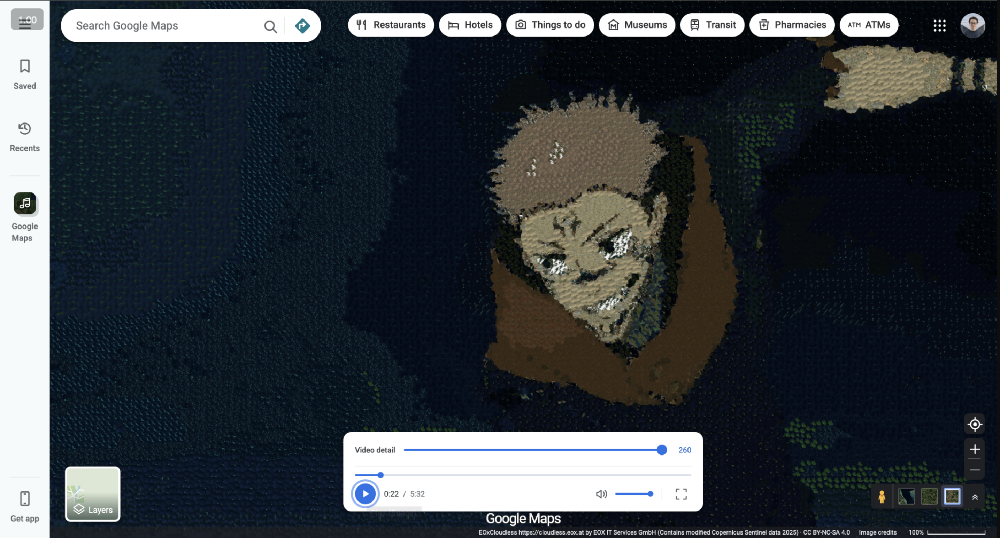

**[Try it out →](https://musicgooglemaps.com)**

# MusicMaps

I built a video player that turns videos into moving mosaics of satellite photos. The original audio keeps playing, and you can click any piece to see where on Earth it came from.

## Run locally

Install Node.js 22.12+ and [Git LFS](https://git-lfs.com/), then run:

```sh
git lfs install
git clone https://github.com/PetarIsakovic/MusicMaps.git
cd MusicMaps
git lfs pull
npm ci
npm run dev
```

Open the URL printed in your terminal. Pick a demo from the search bar or drop in your own video. Adjust **Video detail** to change the number of satellite pieces.

To add videos to the search list, put MP4 files in `public/videos/`.

For a production build, run `npm run build`. The site is output to `dist/`. See [deployment instructions](DEPLOYMENT.md) for Netlify setup.

Satellite imagery from [EOxCloudless](https://cloudless.eox.at/) by EOX IT Services GmbH, containing modified Copernicus Sentinel data 2025. Licensed under [CC BY-NC-SA 4.0](https://creativecommons.org/licenses/by-nc-sa/4.0/).
